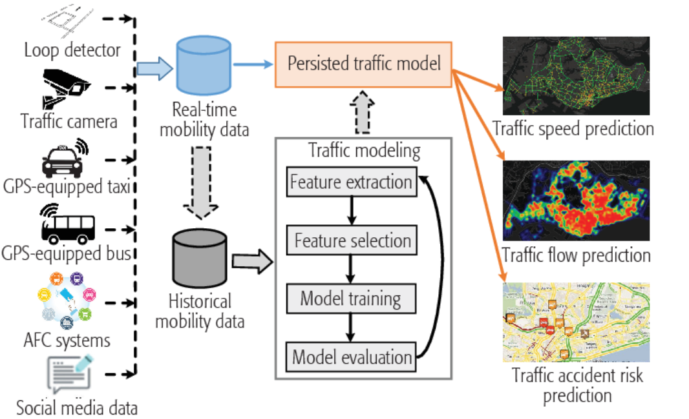
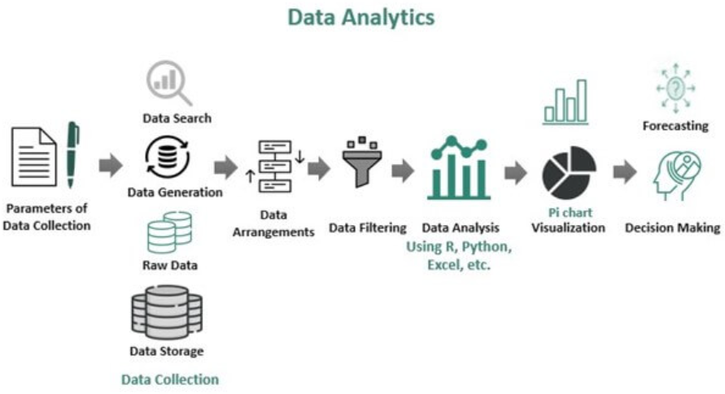
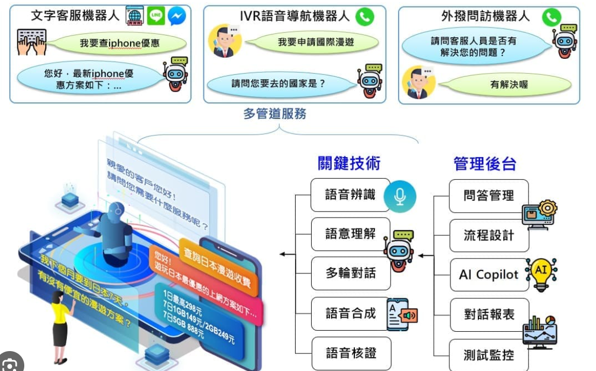
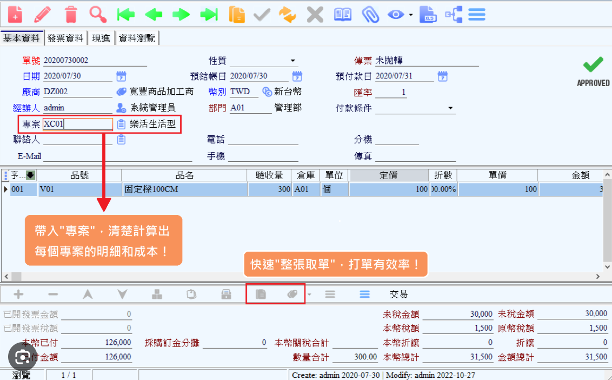

# 作品集

## 系統設計與架構作品

### 智慧城市交通預測系統 (2024)

**專案概述：**
開發了一個基於 AI 的智慧交通預測系統，為城市交通管理部門提供即時路況分析和未來 4 小時內的交通流量預測。

**技術特點：**

- 使用 LSTM 神經網絡模型進行交通流量預測
- 即時數據處理管道，每分鐘處理超過 100 萬筆感應器數據
- 分散式系統架構，支援橫向擴展
- 容器化部署於 Azure Kubernetes Service

**核心技術：**

- Python, TensorFlow, Keras
- Apache Kafka, Apache Spark
- Azure Cloud Services
- Docker, Kubernetes
- React, D3.js (視覺化界面)

### 企業級數據分析平台 (2023)

**專案概述：**
設計並實現了一個企業級數據分析平台，整合多個數據源，提供自動化報表生成和深度分析能力。

**技術特點：**

- 多源數據整合引擎，支援 50+ 種數據格式
- 自動化 ETL 流程
- 可視化報表生成器
- 內建機器學習模型庫

**核心技術：**

- .NET Core, C#
- Apache Airflow
- PostgreSQL, MongoDB
- Azure Synapse Analytics
- Power BI 整合

### 智能客服對話系統 (2023)

**專案概述：**
開發了一個基於自然語言處理的智能客服系統，能夠處理多語言客戶查詢並提供精準回覆。

**技術特點：**

- 多語言支援（中文、英文、日文）
- 情緒分析與意圖識別
- 自動學習與知識庫更新
- 人機協作模式

**核心技術：**

- Python, PyTorch
- FastAPI
- Redis
- Azure OpenAI Service
- Elasticsearch

### 企業資源規劃系統重構 (2022)

**專案概述：**
將傳統單體 ERP 系統重構為現代微服務架構，提升系統效能和可維護性。

**技術特點：**

- 微服務架構設計
- 事件驅動設計模式
- 分散式事務處理
- 無縫遷移策略

**核心技術：**

- .NET Core, C#
- RabbitMQ
- SQL Server
- Docker
- Azure DevOps

## 開源貢獻

### AI 模型優化工具包

- 開發了一個用於優化深度學習模型的開源工具包
- GitHub Stars: 1.2k
- 支援主流深度學習框架
- [查看專案](https://github.com/yourusername/ai-optimizer)

### 微服務測試框架

- 創建了一個簡化微服務測試的框架
- GitHub Stars: 800+
- 整合了常用測試工具和最佳實踐
- [查看專案](https://github.com/yourusername/microservice-testing)
